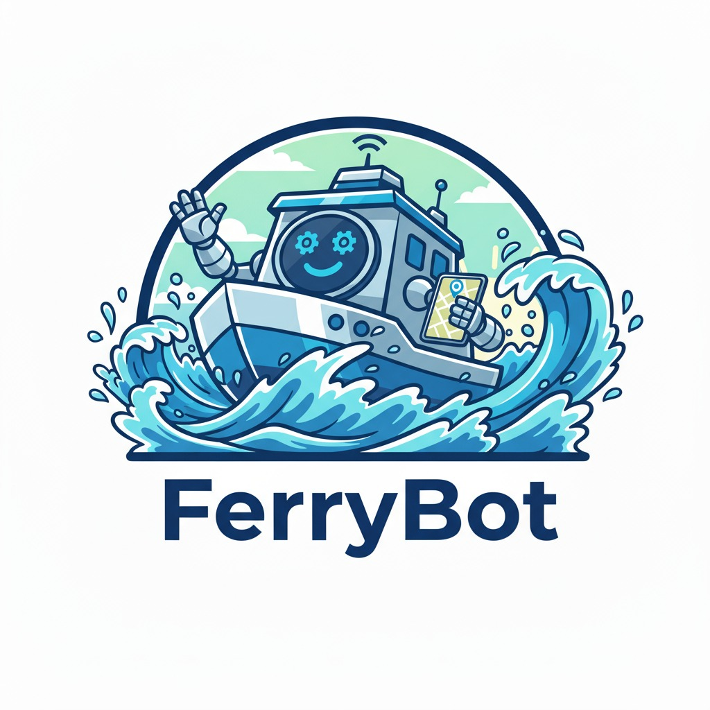

# FerryBot – Sistema de Simulação e Agendamento de Ferry

Plataforma web para agendamento e operação de ferries, com simulações inteligentes baseadas em teoria de filas M/M/4 e análises operacionais para apoio à decisão.

> Exemplo da interface:
>
> 

## 🚀 Principais Módulos

### Módulo do Usuário (público)
- ✅ Agendamento de viagem com verificação de disponibilidade
- ✅ Simulador interativo M/M/4 com comparação de cenários
- ✅ Recomendações automáticas sobre reservar ou não
- ✅ Notificações sobre atrasos e manutenção
- ✅ Canal de relatos/feedback

### Módulo Operacional (admin)
- ✅ Dashboard de métricas (ocupação, espera, picos)
- ✅ Simulação operacional (cenários “e se?”)
- ✅ Painel de manutenção baseado em MTBF
- ✅ Gestão de relatos dos usuários

## 🛠️ Tecnologias

- React 18
- Vite 5 (dev server e build)
- React Router DOM 6
- Tailwind CSS 3 + PostCSS/Autoprefixer
- Recharts (gráficos)
- Framer Motion (animações)
- Lucide React (ícones)
- Context API (estado global)
- ESLint (qualidade de código)

## 📋 Pré-requisitos

- Node.js 18+
- npm 9+ (ou pnpm/yarn, se preferir)

## ▶️ Como executar localmente

1) Instalar dependências

```bash
npm install
```

2) Iniciar o servidor de desenvolvimento

```bash
npm run dev
```

Aplicação em: `http://localhost:3000` (porta definida em `vite.config.js`).

3) Gerar build de produção

```bash
npm run build
```

Saída em `dist/`.

4) Servir a build para preview

```bash
npm run preview
```

## 📁 Estrutura do projeto

```
ferrybot/
├── public/
│   └── ferrybot.png
├── src/
│   ├── components/          # Componentes reutilizáveis
│   │   ├── Button/
│   │   ├── Card/
│   │   ├── Input/
│   │   ├── Select/
│   │   ├── Layout/
│   │   ├── NotificationCard/
│   │   ├── RecommendationCard/
│   │   ├── SimulationChart/
│   │   ├── DashboardChart/
│   │   └── HeatMapChart/
│   ├── pages/               # Páginas
│   │   ├── Home/
│   │   ├── Simulacao/
│   │   ├── Agendamento/
│   │   ├── Relatos/
│   │   └── Admin/
│   │       ├── AdminDashboard/
│   │       ├── AdminSimulacao/
│   │       ├── AdminManutencao/
│   │       └── AdminRelatos/
│   ├── context/             # Estado global (Context API)
│   │   └── FerryContext.jsx
│   ├── utils/               # Utilitários e motor da simulação
│   │   └── simulation.js    # Simulações M/M/4 e cenários operacionais
│   ├── App.jsx
│   ├── main.jsx
│   └── index.css            # Tailwind + estilos globais
├── index.html
├── package.json
├── postcss.config.js
├── tailwind.config.js
├── vite.config.js
└── README.md
```

## 🧮 Teoria de Filas (M/M/4)

Métricas e simulações usadas no sistema:

- Tempo médio de espera (fila e sistema)
- Ocupação (utilização)
- Tamanho médio da fila/sistema
- Probabilidade de espera

Funções principais em `src/utils/simulation.js`:

- `mmcQueue(lambda, mu, servers)`: Métricas M/M/c quando ρ < 1
- `robustFerryMetrics(lambda, mu, servers, options)`: Escolhe automaticamente entre M/M/c e simulação em lotes (ρ ≥ 1)
- `simulateBatchFerry({ ... })`: Simulação por partidas (capacidade por viagem, ciclo em minutos)
- `simulateWaitTime(lambda, mu, servers, params)`: Impacto do agendamento na espera
- `compareReservationVsNoReservation(params)`: Compara cenários com/sem agendamento e gera recomendação
- `calculateMaintenanceStatus(trips, baseMTBF)`: Status de manutenção por MTBF
- `simulateFailureImpact(lambda, mu, availableServers, totalServers)`: Impacto de falhas/indisponibilidade

## 🗺️ Rotas

Público:
- `/` – Home
- `/simulacao` – Simulador de tempo de espera
- `/agendamento` – Agendamento de viagem
- `/relatos` – Canal de relatos

Administrativo:
- `/admin/dashboard` – Métricas
+- `/admin/simulacao` – Simulação operacional
- `/admin/manutencao` – Manutenção (MTBF)
- `/admin/relatos` – Gestão de relatos

## ⚙️ Configuração e temas

- Porta do dev server: `vite.config.js` → `server.port = 3000`
- Tailwind: `tailwind.config.js` e `index.css` (diretivas e tokens de design)
- Gráficos: componentes em `components/*Chart`

## 🔍 Scripts úteis

- `npm run dev` – Ambiente de desenvolvimento
- `npm run build` – Build de produção
- `npm run preview` – Servir a build localmente
- `npm run lint` – Verificação com ESLint

## 🐛 Troubleshooting

Dependências inconsistentes:
```bash
rm -rf node_modules package-lock.json
npm install
```

Porta ocupada (altere a porta):
```js
// vite.config.js
export default {
  server: { port: 3001, open: true }
}
```

Erro de versão do Node com Vite 5:
- Garanta Node.js 18 ou superior (`node -v`).

## 📝 Licença

Projeto desenvolvido para fins educacionais e demonstração.

## 🤝 Contribuição

1. Faça um fork
2. Crie uma branch: `git checkout -b feature/minha-feature`
3. Instale deps e rode localmente: `npm install && npm run dev`
4. Commit: `git commit -m "feat: minha feature"`
5. Push: `git push origin feature/minha-feature`
6. Abra um Pull Request

---

Desenvolvido com ❤️ usando React + Vite
